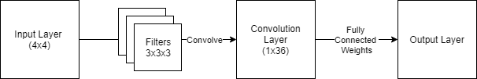

# Simple Convolutional Neural Network for Pattern Recognition

### Input
- 1 4x4 black and white image
- 3 3x3 filters

### Output
- 4 output nodes
- Final filters in CSV
- Final FC weights in CSV

### Architecture

### Contributors
CHAN, Zion Eric O.

FALLAR, Mac Excel S.

RAMOS, Patrick Julian M.

SESE, Miguel Karlo D.
